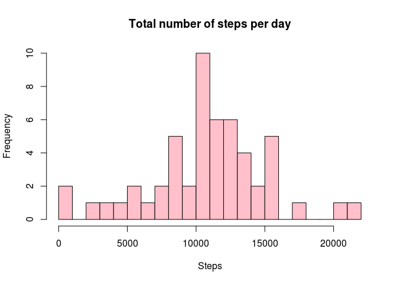
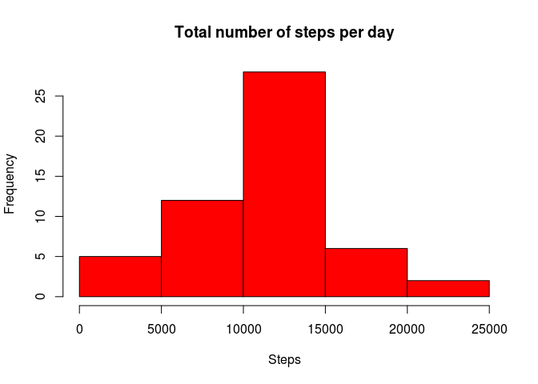
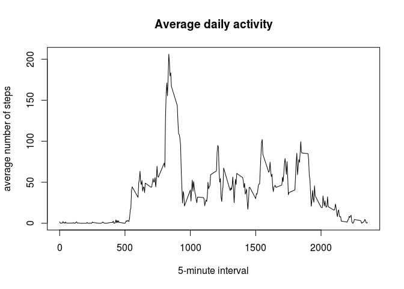
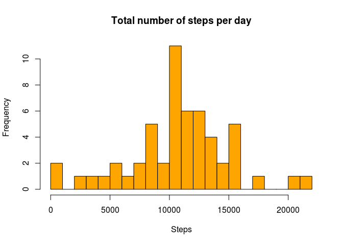
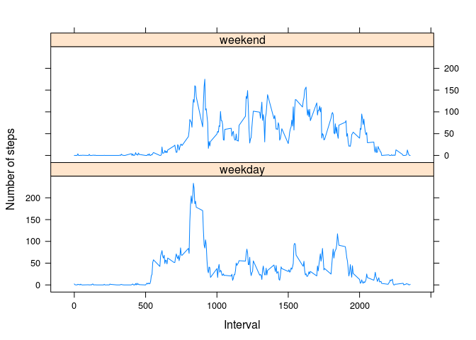

Reproducible Research
======================================================
##Loading and preprocessing the data##

Load zipfile, unpack it and then read csv into dataset

```r
temp <- tempfile()
download.file("http://d396qusza40orc.cloudfront.net/repdata%2Fdata%2Factivity.zip",mode="wb",temp)
data <- read.csv(unz(temp, "activity.csv"))
unlink(temp)
```

##What is mean total number of steps taken per day?##

1. Calculate the total number of steps taken per day (total or totals variables below).
First option is to use aggregate(), second one is to use tapply()
2. Create histogram
3. Calculate and report the mean and median of the total number of steps taken per day

```r
total <- aggregate(steps ~ date, data, sum, na.action = na.omit)
hist(total$steps, main="Total number of steps per day", xlab="Steps", col="pink", breaks = 20)
```

 

```r
mean(total$steps, na.rm = TRUE)
```

```
## [1] 10766.19
```

```r
median(total$steps, na.rm = TRUE)
```

```
## [1] 10765
```
or

```r
totals <- tapply (data$steps, data$date, sum)
hist (totals, main="Total number of steps per day", xlab="Steps", col="red")
```

 

```r
mean(totals, na.rm = TRUE)
```

```
## [1] 10766.19
```

```r
median(totals, na.rm = TRUE)
```

```
## [1] 10765
```

##What is the average daily activity pattern?##

1. Create a time series plot of the 5-minute interval (x-axis) and the average number of steps taken, averaged across all days (y-axis)

```r
activity <- aggregate(steps ~ interval, data, mean, na.action = na.omit)
plot(activity$interval,activity$steps, type = "l", main = "Average daily activity", xlab = "5-minute interval", ylab = "average number of steps")
```

 

2. Which 5-minute interval, on average across all the days in the dataset, contains the maximum number of steps?

```r
activity[which.max(activity$steps),]$interval
```

```
## [1] 835
```

##Imputing missing values##

1. Calculate and report the total number of missing values in the dataset (i.e. the total number of rows with NAs)

```r
totalofNA <- sum(is.na(data$steps))
totalofNA
```

```
## [1] 2304
```

2. The strategy for filling in all of the missing values in the dataset is to use the mean for 5-minute interval
3. Create a new dataset that is equal to the original dataset but with the missing data filled in.

```r
newdata <- data
rowsofNA <- which(is.na(data), arr.ind=TRUE)[,1]
newdata[is.na(newdata)] <- activity[which(activity$interval == data[rowsofNA,]$interval),]$steps
newtotal <- aggregate(steps ~ date, newdata, sum)
head(newdata)
```

```
##       steps       date interval
## 1 1.7169811 2012-10-01        0
## 2 0.3396226 2012-10-01        5
## 3 0.1320755 2012-10-01       10
## 4 0.1509434 2012-10-01       15
## 5 0.0754717 2012-10-01       20
## 6 2.0943396 2012-10-01       25
```

4. Make a histogram of the total number of steps taken each day and Calculate and report the mean and median total number of steps taken per day. 

```r
hist(newtotal$steps, main="Total number of steps per day", xlab="Steps", col="orange", breaks = 20)
```

 

```r
mean(newtotal$steps)
```

```
## [1] 10766.19
```

```r
median(newtotal$steps)
```

```
## [1] 10765.59
```

Mean and medium values are almost the same (mediad is sligtly bigger)

##Are there differences in activity patterns between weekdays and weekends?##
1. Create a new factor variable in the dataset with two levels – “weekday” and “weekend” indicating whether a given date is a weekday or weekend day.
2. Make a panel plot containing a time series plot of the 5-minute interval (x-axis) and the average number of steps taken, averaged across all weekday days or weekend days (y-axis)

```r
library("plyr")
library("lattice")
newdata$weekdays <- weekdays(as.Date(newdata$date))
head(newdata)
```

```
##       steps       date interval weekdays
## 1 1.7169811 2012-10-01        0   måndag
## 2 0.3396226 2012-10-01        5   måndag
## 3 0.1320755 2012-10-01       10   måndag
## 4 0.1509434 2012-10-01       15   måndag
## 5 0.0754717 2012-10-01       20   måndag
## 6 2.0943396 2012-10-01       25   måndag
```

```r
newdata$daytype <- "weekday"
newdata$daytype [newdata$weekdays == "Saturday" | newdata$weekdays == "Sunday"| newdata$weekdays == "lördag"| newdata$weekdays == "söndag"] <- "weekend"
head(newdata)
```

```
##       steps       date interval weekdays daytype
## 1 1.7169811 2012-10-01        0   måndag weekday
## 2 0.3396226 2012-10-01        5   måndag weekday
## 3 0.1320755 2012-10-01       10   måndag weekday
## 4 0.1509434 2012-10-01       15   måndag weekday
## 5 0.0754717 2012-10-01       20   måndag weekday
## 6 2.0943396 2012-10-01       25   måndag weekday
```

```r
wkdata <- ddply(newdata, c("interval", "daytype"), summarise, mean = mean(steps, na.rm = TRUE))
xyplot(mean ~ interval| daytype, wkdata, type = "l", layout = c(1,2), xlab = "Interval", ylab = "Number of steps")
```

 

(lördag, söndag - sunday and saturday in swedish)
